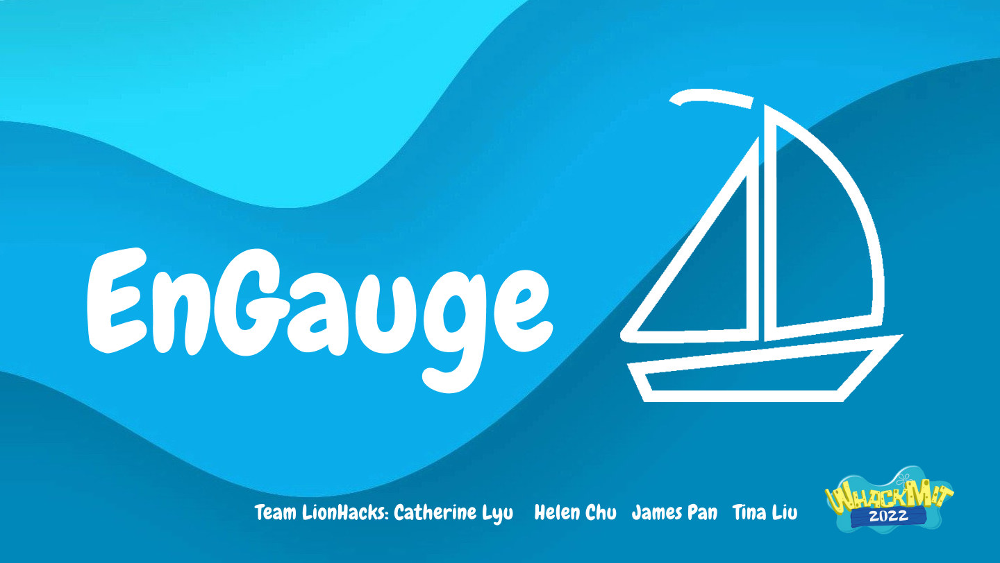

# EnGauge: a HackMIT 2022 Project
*Bringing the best of virtual learning to in person classrooms*

Have you ever given a presentation or lecture? During the lecture, did you question whether the crowd was listening to you? EnGauge is designed to answer this question by gathering live feedback from the audience. There are two main functionalities in our current prototype. 
1. The EnGauge-o-meter: students can submit their level of attention to our server, and it will update an engagement score real-time such that instructors can change their teaching strategies accordingly. 
2. A smart Question bank: students always have questions - when they submit questions, we use a NLP algorithm to classify and sort questions based on similarity and upvotes. Learn more, teach better, with EnGauge.

### How we built it?
- Python
- HTML/CSS/Javascript
- Firebase
- Heroku
- Figma

